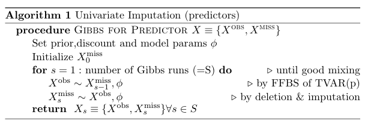

# missing_val_imputation

My original codes from STA642 final project and the final report

To run this code, additional codes from Mike West's library is required (not provided here).

## Overview of the Project

The original intention of this project was to use DLMs (Dynamic Linear Models) to model time evolution of genetic variation in Daphnia (commonly known as water fleas) population in relation to the parasite activities within the habitat while also controling for other factors such as temperature, oxygen density etc.

The academic rationale behind it is to look for empirical evidence of evolutionary theory called Red Queen Hypothesis which postulates the dynamics between parasite and its host to evolve in response to each others' temporal dominance.

In the end, due to the extent of the missingness of the data, the project changed the objective and instead focused on building a methodology to impute missing observations utilizing the information of the other series it is modeled against.

## Results and Comments

Here instead of Daphnia & Parasite data which tuned out to be missing too many data points, I present the result of missing value imputation using sales & index series data from STA642 class.

Since we have complete data for sales & index series, we can randomly take out data points from these series and check the performance of the missing value imputation scheme.

The use case in consideration is that we want to model the sales series by Dynamic regression with respect to index series when both series have missing data on several occasions.

We save the technical details of the imputation to the next section and just present the result here with some comments.

For both series shown above, around 20% of the observations are deleted and imputed by my algorithm with 95% predictive intervals depicted in gray color.

As we can see, all actual data (blue circles) falls within the gray bounds for index series (the top figure) with varying degrees of uncertainty (quite high uncertainty in early stages due to concentration of missing data around that time period).

Imputation result for sales data is slightly worse which is unsurprising since it is modeled with the imputed indexed data so the uncertainty in the missing values comes from missingness in both sales and index data.

However, the overall performane of the missing value imputation is good as we can check with the next figure shown below.

Smoothed coef from missing data imputation             |  Smoothed coef from complete data
:-------------------------:|:-------------------------:
  |  

As we can see, the smoothed estimate and intervals of the coefficient of the dynamic regression is quite alike and would yield almost the same inference. 

## Methodology (only for interested readers)

The overview of the  missing value imputation is as follows: we first impute index series univariately by running TVAR within each iteration of gibbs sampling and then proceeds to impute sales series with yet another gibbs sampling, this time running Dynamic regression using imputed index series within each iteration.

The pseudo code of this procedure is given below:
	

where FFBS stands for forward filtering backward sampling and deletino & imputation is basically sampling using conditional normal structure as detailed in Harrison and Veerapen (1993).